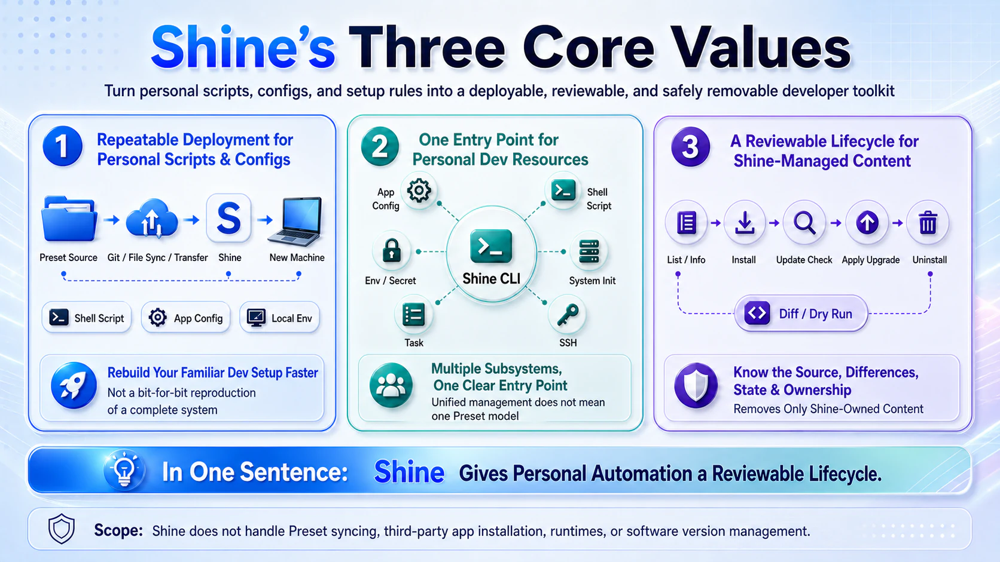

# Shine

Turn the scripts and configuration you use every day into personal tools you can install, update,
and remove cleanly.

You may already sync those files between machines. But after they arrive, scripts still need to be
added to `PATH`, application configuration still needs the right destination, and local values
should not travel inside shared files. Updating everything by hand also makes it hard to know what
will be overwritten. Personal configuration also ends up scattered across shell files, application
directories, and system-specific paths, which makes it difficult to maintain, reuse, or share.

Shine brings your scripts, personal configuration, and their installation rules together in a
**Preset**. Maintain and share the preset folder in one place; Shine installs each item where it
belongs. Install only what you need, see what changed before updating, and remove it later without
deleting unrelated files.

**Give personal automation a reviewable lifecycle.**

**Documentation:** [English](https://biulight.github.io/shine/) ·
[简体中文](https://biulight.github.io/shine/zh-Hans/)

[](website/static/img/shine-core-values-en.webp)

## What Shine helps you do

- **Use a script like any other command.** Install it once and call it by name from `PATH`.
- **Keep personal configuration together.** Maintain it in one preset folder; Shine copies,
  transforms, or merges each file where its application expects it.
- **Keep each machine's values on that machine.** A preset declares the keys it needs; you provide
  the values locally.
- **Look before you update.** By default, inspect what changed first; Shine applies it only when you
  choose to upgrade.
- **Remove only what Shine installed.** Your source folder and unrelated files stay in place.

## Try what is already included

- Install `shell/proxy` to get `setproxy` and `usetproxy` as regular commands.
- Browse ready-made configuration for tools such as Starship, Git, Vim, and Ghostty.
- Use the guided Surge and Clash Verge Rev workflows when you need their application-specific setup.

```bash
shine list --available
shine install shell/proxy
shine info shell/proxy
```

Follow the [quick start](https://biulight.github.io/shine/quick-start) for the complete first run.

## Make it yours

A preset folder can arrive through any folder-sync tool, archive, network transfer, version-control
checkout, or manual copy. Shine does not prescribe how you share it.

Your own presets might package batch renaming, image compression and resizing, spreadsheet cleanup,
or document printing as reusable commands. These are ideas you can build, not bundled tools; each
command still needs its application or runtime on the machine. Start with the [custom preset
guide](https://biulight.github.io/shine/guides/custom-presets).

Shine can also prepare selected parts of macOS, Ubuntu, or Windows, but it does not take over
third-party tool versions. See [system initialization](https://biulight.github.io/shine/guides/system-init)
for that boundary.

## Installation

macOS and Linux:

```bash
curl -fsSL https://github.com/biulight/shine/releases/latest/download/install.sh | sh
```

Windows PowerShell:

```powershell
irm https://github.com/biulight/shine/releases/latest/download/install.ps1 | iex
```

From crates.io with Rust 1.88 or later:

```bash
cargo install shine-cli
```

## Development

Toolchain versions are pinned in `mise.toml`:

```bash
mise install
bun install --frozen-lockfile
cargo nextest run --all-features
cargo clippy --all-targets --all-features --tests --benches -- -D warnings
cargo fmt --check
bun run check:ts
```

The public documentation site is isolated under `website/`:

```bash
cd website
pnpm install --frozen-lockfile
pnpm check:locales
pnpm typecheck
pnpm build
```

Planning uses the issue workflow in [`docs/PLAN.md`](docs/PLAN.md). Contributor architecture,
invariants, and verification rules live in [`AGENTS.md`](AGENTS.md) and [`docs/kb/`](docs/kb/).

Regular development targets `release`. Version tags are created from `release`, and the release
workflow opens the post-release synchronization PR to `main`.

## License

MIT OR Apache-2.0
